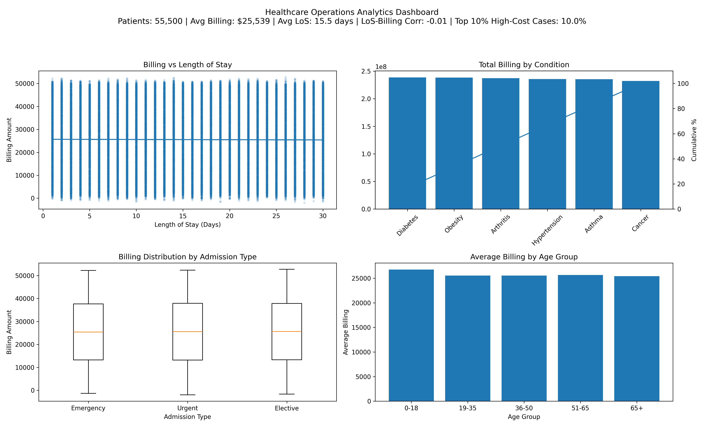

# **Healthcare Operations Analytics**

End-to-End Data Analysis & Cost Driver Investigation (Python)
An end-to-end healthcare analytics project designed to simulate operational cost analysis within a hospital system. This project focuses on identifying billing patterns, cost drivers, patient segmentation trends, and operational efficiency indicators using structured healthcare data.

## **Dashboard Preview**

 
## **Project Objective**

To analyze patient-level healthcare data in order to:
- Identify primary drivers of hospital billing
- Evaluate the relationship between Length of Stay (LoS) and total charges
- Segment cost behavior by admission type, condition, and age group
- Detect high-cost outlier cases
- Create an executive-style analytics dashboard for decision support

## **Analytical Workflow**

_Data Preparation_
- Cleaned and validated structured healthcare dataset
- Converted date fields to proper datetime format
Engineered new features:
- Length of Stay (LoS)
- Cost per Day
- Age Groups
- Standardized categorical variables
- Sorted and structured for operational analysis

**Exploratory Data Analysis (EDA)**
- Distribution analysis of billing and cost per day
- Outlier detection (Top 10% cost concentration)
- Correlation analysis (LoS vs Billing)
- Admission type comparison (Emergency vs Urgent vs Elective)
- Condition-level cost aggregation

**Visualization & Reporting**
- Built multi-panel analytics dashboard using Matplotlib
Highlighted:
- Cost distribution by admission type
- Billing vs Length of Stay relationship
- Total billing by medical condition
- Average billing by age group
- Included executive summary metrics

## **Key Findings**
- Average Billing per Patient: $25,539
- Average Length of Stay: 15.5 days
- LoS–Billing Correlation: -0.01 (minimal relationship)
- Billing variation is driven more strongly by medical condition than by length of stay.
- High-cost cases are concentrated within the top 10% of patients.
- Admission type shows comparable billing medians but varying distribution spreads.

## **Technical Stack**
- Python
- Pandas (data manipulation)
- NumPy (numerical operations)
- Matplotlib (visualization)
- Seaborn (distribution analysis)

## **How to Run**

_Clone repository:_
``` 
git clone https://github.com/tjongleonardo/healthcare-dataset-analytics.git
cd healthcare-dataset-analytics
```
_Install dependencies:_
```
pip install -r requirements.txt
```
_Run analysis pipeline:_
```
python Source/Analysis.py
python Source/Dashboard.py
```
## **Skills Demonstrated**
- Data Cleaning & Feature Engineering
- Exploratory Data Analysis (EDA)
- Correlation & Cost Modeling
- Data Visualization & Dashboard Development
- Business Insight Communication
- Structured Project Architecture

## **Data Source & Disclaimer**

This project uses a publicly available synthetic healthcare dataset from Kaggle:
Healthcare Dataset

Source: Kaggle

Author: prasad22

Link: https://www.kaggle.com/datasets/prasad22/healthcare-dataset/data

The dataset is fully synthetic and was used strictly for educational and portfolio purposes.
No real patient data, protected health information (PHI), or confidential records were used in this analysis.

## **Portfolio Context**

This project was developed as part of a personal analytics portfolio focused on healthcare operations and financial analysis. It demonstrates applied data analysis techniques aligned with real-world operational decision-making.

